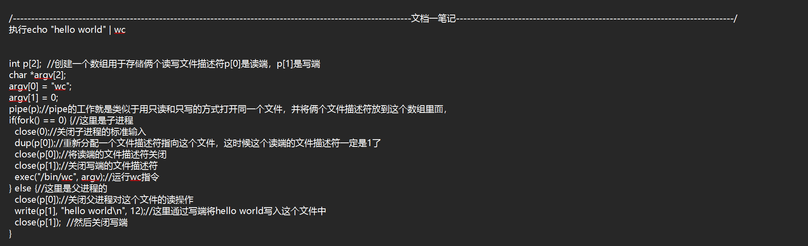
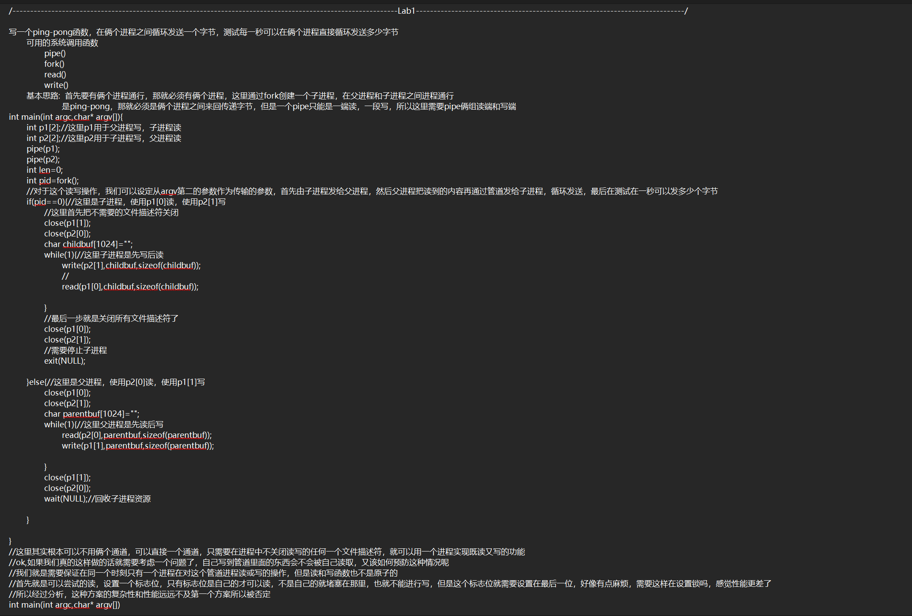
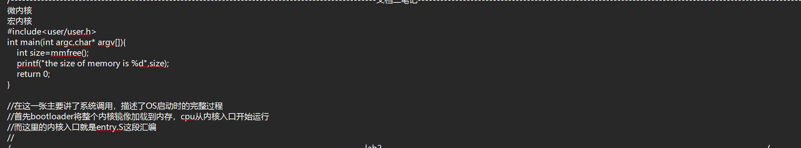
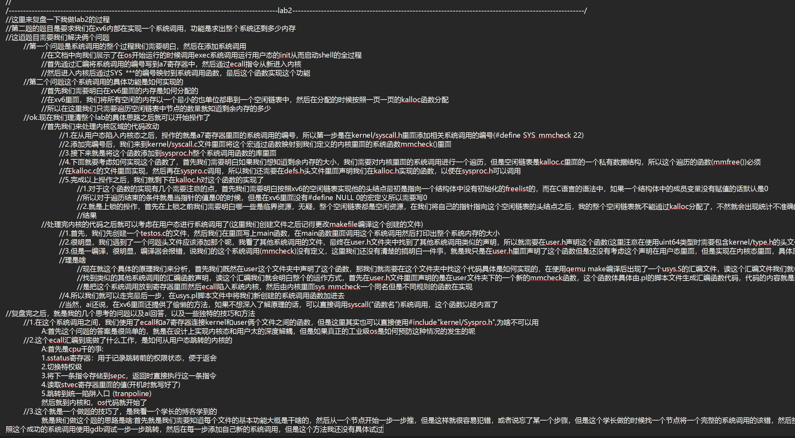

# 关于作者 & 仓库说明

## 📌 记录
### 这是我第一次在 GitHub 上上传仓库，上传这个主要有几点原因：
1.  学习 Git 的基础使用，以及如何向 GitHub 推送代码与文档
2.  看完操作系统导论后，想通过 xv6 实验，记录我的学习与实践过程
3.  学习 Markdown 写作，以及开源项目中 LICENSE、.gitignore 等基础配置的作用

---

## 🛠️ 我是如何做这个 xv6 实验的？
### 前置知识
1.  我没有看 MIT 的全英文课程，主要参考了《操作系统导论》这本书，完整读了一遍
2.  看书的同时，按照导论的章节顺序，阅读了一部分 xv6 的源码，基本理解了操作系统的运行逻辑
3.  最后参考了 xv6 官方实验文档，动手完成了 Lab1、Lab2

---

## ⚠️ 提醒
由于我在做前两个实验时，一开始没有打算发 GitHub，所以现在的实验解析，是我自己的手写笔记，再让 AI 帮我修改生成 Markdown 文档，之后我自己也手动调整过。
因此，文档里的内容可能和我最原始的做题思路不完全一致。如果有需要，我也会把最原始的手写笔记截图附在这里，供大家参考。
### lab1文档的笔记

### lab1的复盘

### lab2的随记

### lab2的复盘
